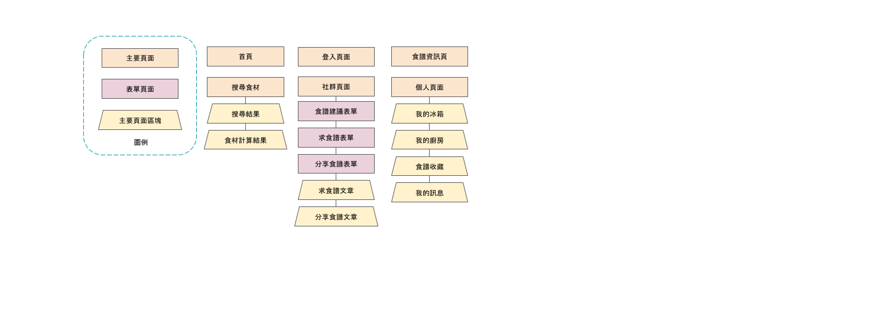
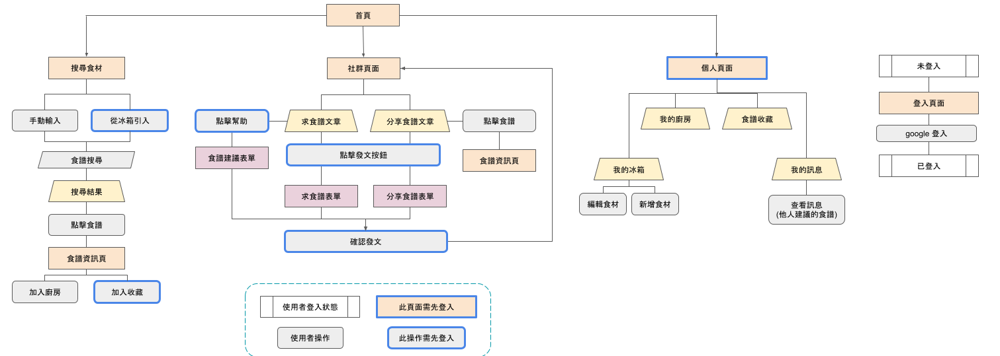

# FridgeOut
- FridgeOut is a recipe searching website attempting to clean your fridge.
- Add your leftover ingredients in the list, then search recipes in just a few clicks.
- Search thousands of recipes by ingredients, see how many ingredients you need at a glance.
- Ask for recipes or share recipes to the community.

## Demo Link
[Fridge Out website](https://leftoverrecipe-3910d.web.app/)

Please login with your google account.

## Technologies

#### Recipe Data
- Crawled and scraped from [楊桃美食網](https://www.ytower.com.tw/) by [crawler](https://www.npmjs.com/package/crawler)
#### Front-End
- ReactJS / Redux / Redux thunk / React Router
- styled-components 
- Firebase 
  - authentication
  - storage
  - firestore
  - hosting
#### Miscellaneous
- Animated.css
- lodash
- mathjs
- react-animated-css
- react-perfect-scrollbar
- reactjs-popup
- uuid
- jest

 
## Flow Chart

## Features
- Applied **React Router** for single-page React application
- Applied **smooth transition animations** with Animate.css
- Calculated ingredient amount with different units
- Constructed the database by **crawling and scraping** recipes from websites with crawler.js
- Hosted the website with **Firebase Hosting**
- Implemented Google login method with **Firebase Auth**
- Managed data flow with **Redux** and **Firebase**
- Synchronize data between Redux and Firebase with **Redux thunk**
- Used **styled-component** for component encapsulation

## Future features
- Generate shoplist of ingredients for recipes in "我的廚房".
- Add ingredient expire date alert.
- Ingredient purchasing informations (where to buy).
- More recipe uploads.

