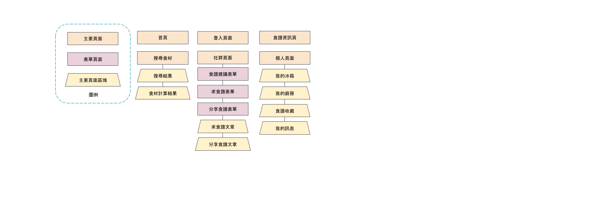
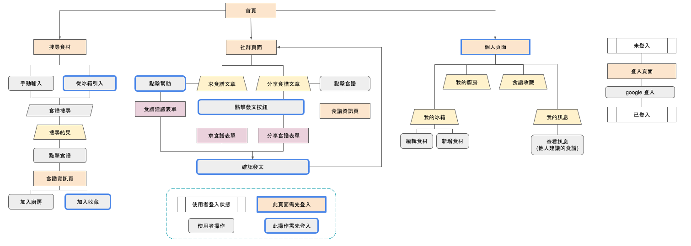

<h2 align="center">FridgeOut</h2>

- FridgeOut is a recipe searching website attempting to clean your fridge.
- Add your leftover ingredients in the list, then search recipes in just a few clicks.
- Search thousands of recipes by ingredients, see how many ingredients you need at a glance.
- Ask for recipes or share recipes with the community.

## Demo Link
[FridgeOut website >>](https://leftoverrecipe-3910d.web.app/)

Please login with your google account for full experiences.

## Technologies

#### Recipe Data
- Crawled and scraped from [楊桃美食網](https://www.ytower.com.tw/) by [crawler](https://www.npmjs.com/package/crawler)
#### Front-End
- ReactJS / Redux / Redux thunk / React Router
- styled-components 
- Firebase 
  - authentication
  - storage
  - firestore
  - hosting
#### Miscellaneous
- Animated.css
- lodash
- mathjs
- react-animated-css
- react-perfect-scrollbar
- reactjs-popup
- uuid
- jest

 
## Flow Chart

## Features
- #### Search recipes with ingredients.

- #### Browse recipes and add recipes to favorite / kitchen.

- #### FridgeOut will calculate the ingredients you need for you.

- #### Add / edit ingredients to your fridge, so you can search by few clicks.

- #### No recipe found ? Ask for others help !

- #### Help others think of recipes with their ingredients !

- #### Contribute your recipe to the community.

## Future features
- Generate shoplist of ingredients for recipes in "我的廚房".
- Add ingredient expire date alert.
- Ingredient purchasing informations (where to buy).
- More recipe uploads.

